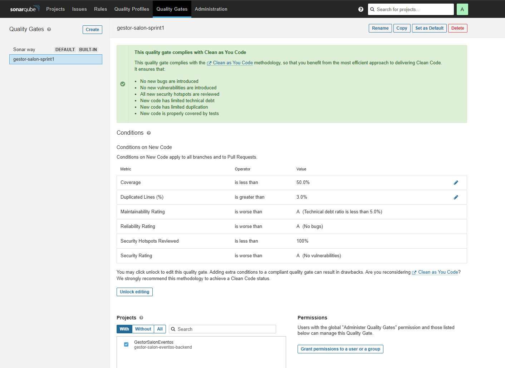

# ADR-0002: SonarQube quality gate as a merge criterion

## Context

The working agreement requires quality gates to be green before merging into `main`. Starting
this sprint, the pipeline runs SonarQube with JaCoCo coverage on every PR and on every push to
`main`. Sonar's default gate ("Sonar way") requires 80% coverage on new code. The project has
unit tests only in `mapper/` plus a startup test; services, controllers and security are at 0%.
With that threshold, any PR touching a class without tests fails even when the change is
correct, and the temptation would be to turn the gate off.

## Decision

- Create our own quality gate, `gestor-salon-sprint1`, a copy of "Sonar way" with
  "Coverage on New Code" set to 50%. The remaining conditions stay as they are: zero new
  bugs and vulnerabilities, 100% of new hotspots reviewed, duplication on new code ≤ 3%.
- Define "new code" on the `main` branch with a fixed baseline ("Specific analysis"): the
  first `main` analysis after merging #8 (2026-09-13). Code older than that baseline is
  legacy and is not required to be covered; every later change is. "Previous version" is
  rejected (the `0.1.0-SNAPSHOT` version never changes) and so is "number of days": the
  whole project was committed within the same week, so 100% of the code counted as new and
  the first `main` analysis failed the gate on coverage
  ([run 34783682667, attempt 1](https://github.com/Skzyyx/gestor-salon-eventos-backend/actions/runs/34783682667/attempts/1));
  [attempt 2](https://github.com/Skzyyx/gestor-salon-eventos-backend/actions/runs/34783682667)
  passed with the same commit once the baseline was set.
- The gate is blocking (`sonar.qualitygate.wait=true`) and is part of the `Build` status
  check required by the branch protection rules on `main`.
- The threshold may only be changed through a new ADR.

## Alternatives considered

- **Keep the 80% from "Sonar way".** It is the recommended practice ("Clean as You Code"),
  but today it would block the first PR containing Java code. Rejected for now; it remains
  the goal.
- **Drop `sonar.qualitygate.wait`.** The analysis would still be published, but it would not
  block anything. Rejected: a gate that does not block is not a quality gate.
- **Exclude untested packages from coverage.** Hides the problem instead of measuring it.

## Trade-offs / consequences

- (+) The gate is honoured from the very first PR; nobody switches it off "for the time being".
- (+) Every PR touching Java brings at least half of its new lines covered.
- (−) 50% lets code through with thin coverage. Mitigated by the two-person review and by the
  commitment to raise it to 80% once `service/` has tests (target: Sprint 3).
- (−) The fixed baseline leaves all legacy code outside the gate; its coverage only improves
  when someone touches it or the team decides to cover it on purpose.

## Validation evidence

- Gate `gestor-salon-sprint1` assigned to the project in SonarQube:
  
- PR 5 analysed with the gate green and coverage > 0%: [#8](https://github.com/Skzyyx/gestor-salon-eventos-backend/pull/8) · [Sonar Analysis](http://66.70.181.143:26665/dashboard?id=gestor-salon-eventos-backend&pullRequest=8).
- PR 6, the first PR with Java code evaluated under the gate, gate green with 4 legacy
  findings resolved (13 code smells remain open on `main`, none of them new):
  [#9](https://github.com/Skzyyx/gestor-salon-eventos-backend/pull/9) ·
  [Sonar analysis](http://66.70.181.143:26665/dashboard?id=gestor-salon-eventos-backend&pullRequest=9).